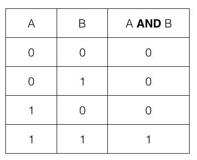
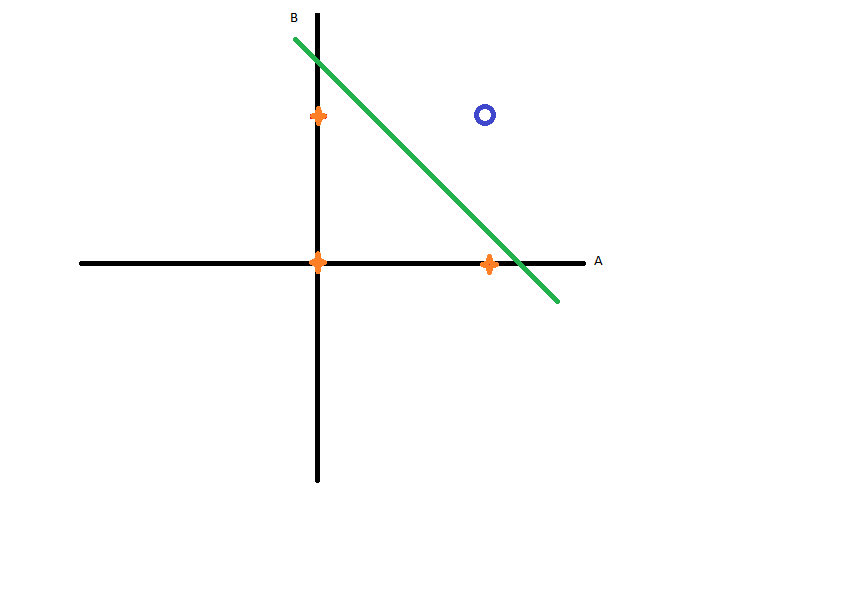
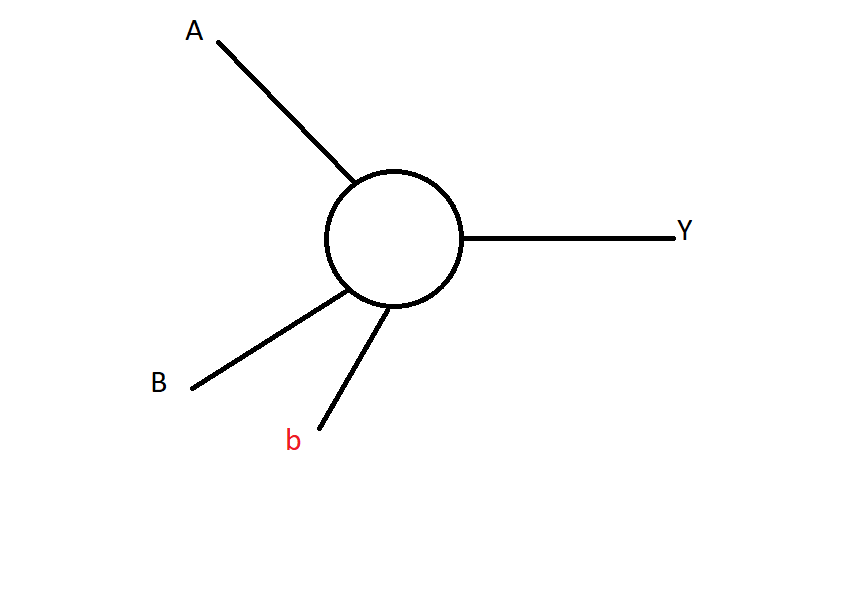

# Single-Layer-Neural-Network
Implementation of "and" function with single layer neural network
# AND: 
The AND gate is a basic digital logic gate that implements logical conjunction - it behaves according to the truth table provided below.

# Neural Network: 
logic gates like “OR”, “AND” or “NAND” can have 0's and 1's separated by a single line

We can use a single layer neural network to implement this gate.

